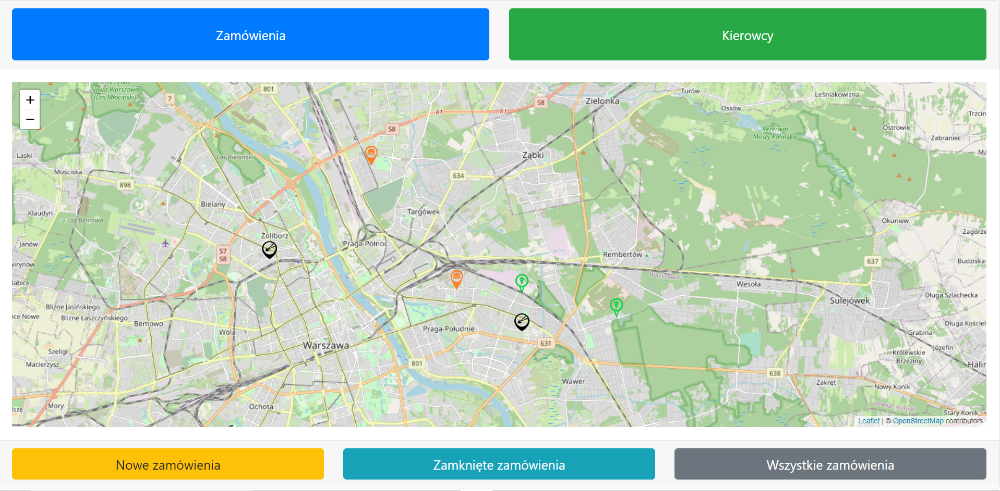
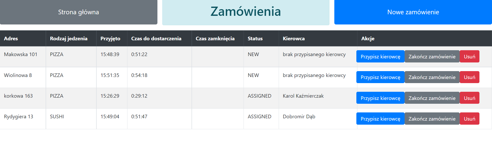
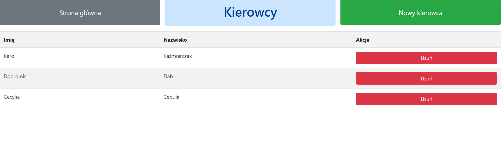
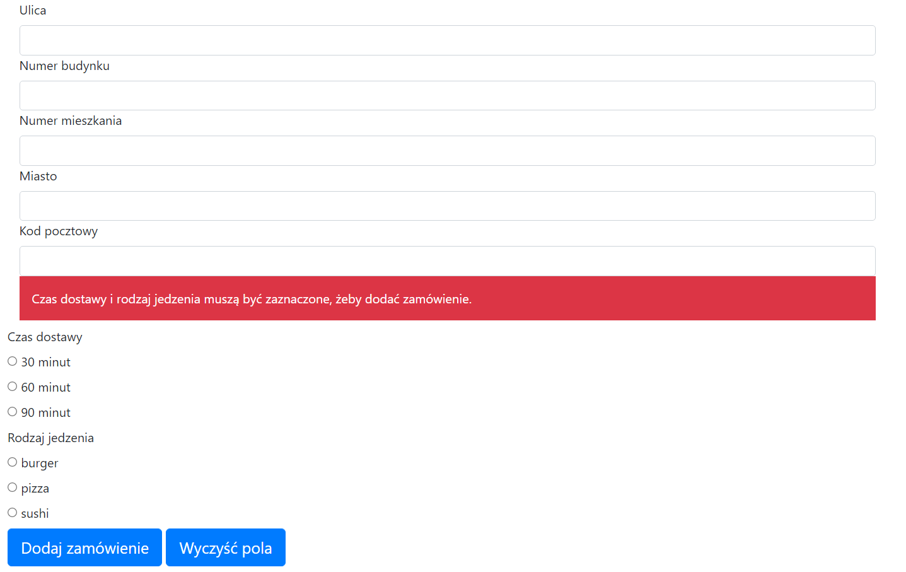

# Simple Order Manager

## General info
The application that manages orders in restaurants. In this case we have three: burger, pizza and sushi. 
Orders are deliver by drivers group, collective to mentioned above restaurants.   
## Used technologies
- Spring Boot
- Spring Data JPA
- Postgres
- Gradle
- Thymeleaf
- locationIQ
## Run application
To run program type ```gradle bootRun``` in command line console, in project folder.
## Screenshots


